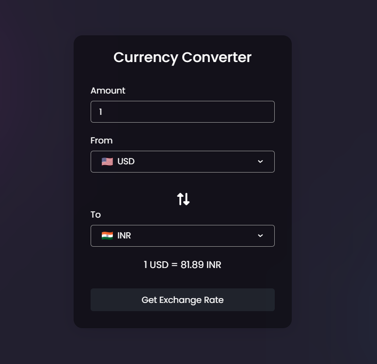

# Currency Converter

This project allows user to convert currency from one country to another.
This is built using HTML, CSS and Javascript.
And uploaded in github via git.


# Warning!

you need to get your **own api** from https://www.exchangerate-api.com and replace it in this line 28
```
const response = await fetch(`https://v6.exchangerate-api.com/v6/[YOUR_KEY]]/latest/${fromCur.value}`);
```

## Screenshot
